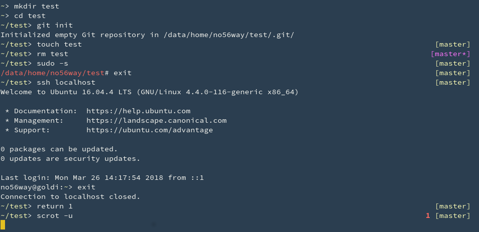

### fromscratch theme

ZSH theme with two prompts.

Left prompt:
  - user@host is only shown, when connected via ssh, or inside a docker container.
  - Color of the current directory changes, when the shell is running with privileges.

Right prompt:
  - The last return code is shown if it was not 0.
  - Current git branch is shown, color indicates clean or dirty state.

#### Screenshot

The screenshot shows a xterm using [Lucario](https://github.com/raphamorim/lucario) color scheme.
